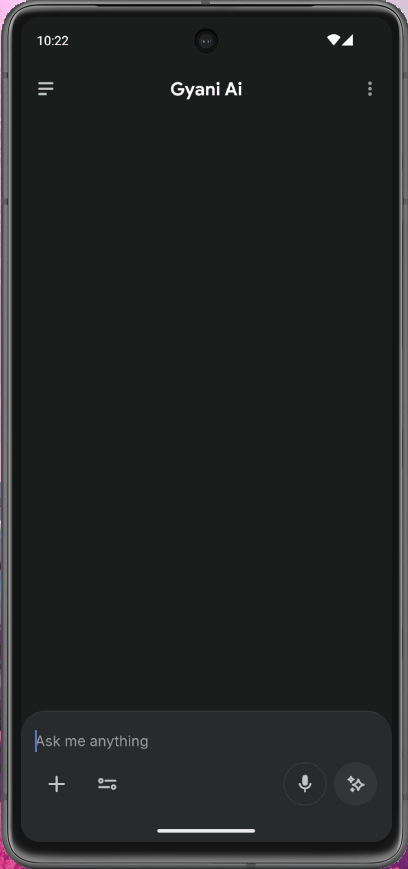
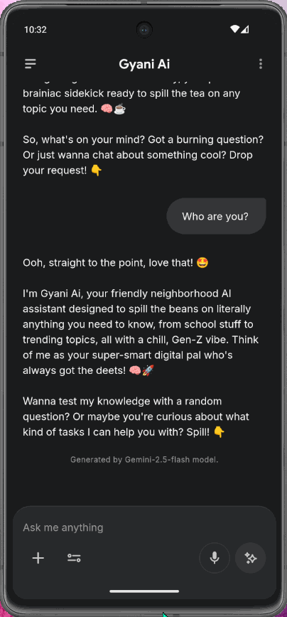
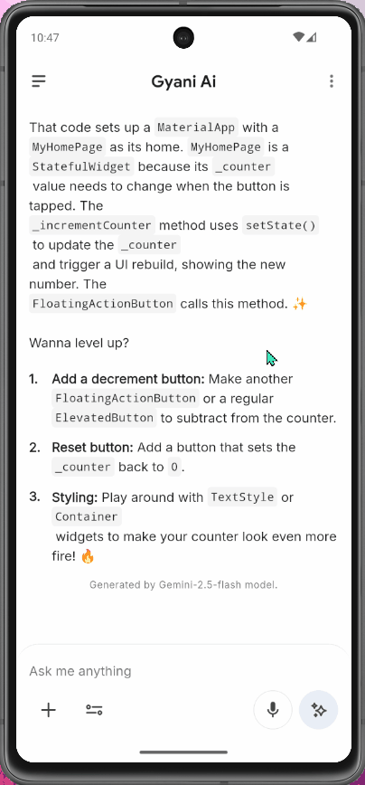
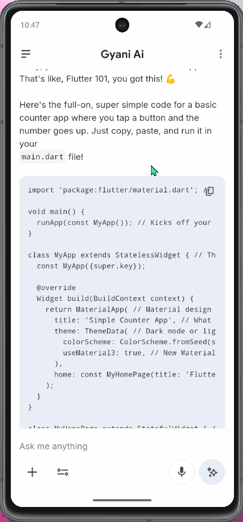

<div align="center">

# ✨ Gyani AI

### *Your Gen-Z AI companion, powered by Google Gemini*

[](https://flutter.dev)
[](https://dart.dev)
[](https://firebase.google.com)
[](https://deepmind.google/technologies/gemini/)
[](LICENSE)

</div>

---

## 📖 About

**Gyani AI** is a sleek, modern Flutter chat application that brings Google's most capable **Gemini 2.5 Flash** model directly to your fingertips. Built with a clean architecture and Material Design 3 aesthetics, it delivers a fluid, real-time conversational experience — complete with Gen-Z vibes, helpful follow-up suggestions, and beautiful markdown-rendered responses.

> *"Gyani"* (ज्ञानी) — Sanskrit for *the wise one* 🧠

---

## 🎬 Demo

<div align="center">

| Greeting the AI | Writing Code | Copying Code | Switching Theme |
|:---:|:---:|:---:|:---:|
|  |  |  |  |

</div>

---

## ✨ Features

- 🤖 **Gemini 2.5 Flash** — Powered by Google's fastest and most efficient multimodal model
- ⚡ **Real-time Streaming** — AI responses stream token-by-token for an instant, alive feel
- 💬 **Multi-turn Conversations** — Full conversation history is maintained and passed as context
- 📝 **Rich Markdown Rendering** — Code blocks, bold, italic, lists — rendered beautifully
- 🌗 **Light & Dark Mode** — Seamlessly adapts to your system's theme preference
- 📋 **Selectable AI Responses** — Copy any part of the response with native text selection
- 🎨 **Material Design 3** — Polished, modern UI with custom color schemes and rounded surfaces
- 🔤 **Custom Typography** — Uses **Inter** and **Google Sans** fonts for a premium reading experience
- 🛡️ **Graceful Error Handling** — Custom `AiException` surfaces errors elegantly in the chat
- 🎯 **Animated Send Button** — Smooth `AnimatedSwitcher` transition between the AI-edit and send icons

---

## 🏗️ Architecture

Gyani AI is structured with a clean, layered architecture for scalability and maintainability:

```
lib/
├── data/              # Data sources & API implementation
│   └── gemini_api.dart        # GeminiApiImpl (streaming)
├── domain/            # Business logic & entities
│   └── entity/
│       └── chat.dart          # Chat entity model
├── presentation/      # UI layer
│   ├── bloc/                  # State management (BLoC)
│   │   ├── chat_list_bloc.dart
│   │   ├── chat_list_event.dart
│   │   └── chat_list_state.dart
│   └── pages/
│       └── chat_page.dart     # Main chat screen
├── theme/             # Design system
│   ├── theme.dart             # Light & Dark ThemeData
│   └── constants.dart         # Spacing, radius, icon tokens
├── widgets/           # Reusable UI components
│   ├── mark_down_text.dart    # Markdown renderer widget
│   ├── stream_loading_indicator.dart
│   └── vector_icon.dart       # SVG icon wrapper
└── error/
    └── ai_exception.dart      # Custom exception handler
```

### State Management — BLoC Pattern

Gyani AI uses the **BLoC (Business Logic Component)** pattern for a clear separation between UI and business logic:

```
ChatAdd (user prompt) ──► ChatListBloc ──► ResponseStreaming (stream begins)
                                       └──► ResponseInitial  (stream complete)
ChatError ─────────────► ChatListBloc ──► ResponseError (displayed in chat)
```

---

## 🛠️ Tech Stack

| Technology | Purpose |
|---|---|
| **Flutter 3** | Cross-platform UI framework |
| **Dart 3.10** | Language — with pattern matching & sealed classes |
| **Firebase AI** | Gemini model integration via Firebase |
| **Gemini 2.5 Flash** | LLM powering all AI responses |
| **flutter_bloc ^9** | BLoC state management |
| **flutter_markdown_plus** | Rendering rich markdown in chat |
| **flutter_svg** | SVG icon rendering |
| **Material Design 3** | UI design system |
| **Inter & Google Sans** | Custom bundled fonts |

---

## 🚀 Getting Started

### Prerequisites

- Flutter SDK `>=3.10.0`
- A Firebase project with **Firebase AI (Gemini API)** enabled
- `FlutterFire CLI` for Firebase setup

### Installation

1. **Clone the repository**
   ```bash
   git clone https://github.com/your-username/flutter_ai.git
   cd flutter_ai
   ```

2. **Install dependencies**
   ```bash
   flutter pub get
   ```

3. **Configure Firebase**

   Set up a Firebase project and enable the **Gemini API** within Firebase AI. Then run:
   ```bash
   flutterfire configure
   ```
   This generates `lib/firebase_options.dart` automatically.

4. **Run the app**
   ```bash
   flutter run
   ```

> ⚠️ **Note:** `lib/firebase_options.dart` and `lib/dummy_data.dart` are excluded from version control via `.gitignore` to protect sensitive API keys.

---

## 🎨 Design System

Gyani AI features a fully custom Material Design 3 theme with hand-picked color palettes:

| Token | Light Mode | Dark Mode |
|---|---|---|
| Primary | `#3C80EE` (Blue) | `#3C80EE` (Blue) |
| Surface | `#FFFFFF` | `#1B1C1D` |
| Surface Container | `#FFFFFF` | `#282A2C` |
| Primary Container | `#E9EEF6` | `#333537` |
| Error | `#D2463F` | `#A64D47` |
| Error Container | `#FFE9E7` | `#3A221F` |

---

## 🤖 AI Personality

Gyani AI has a carefully crafted system prompt giving it a distinct, engaging personality:

- 🌟 **Starts with a brief compliment** to keep things positive
- 🧠 **Delivers a concise, info-dense answer** — no fluff
- 💡 **Suggests 2–3 related follow-up questions** to continue the conversation
- 😎 **Gen-Z tone** with tasteful emoji use — smart but relatable

---

## 📦 Project Highlights

- ✅ **Dart 3 sealed classes & pattern matching** for expressive state modeling
- ✅ **Streaming generator functions** (`async*` / `yield`) for real-time response delivery
- ✅ **`SchedulerBinding.addPostFrameCallback`** for safe post-stream UI updates
- ✅ **`ValueNotifier` + `ValueListenableBuilder`** for fine-grained, isolated widget rebuilds
- ✅ **`AnimatedSwitcher`** for smooth icon transitions in the input panel
- ✅ **`SafeArea`** and keyboard-aware layout for safe rendering across all devices

---

## 📄 License

This project is licensed under the **MIT License** — feel free to fork, learn, and build upon it!

---

<div align="center">

Made with ❤️ and Flutter &nbsp;•&nbsp; Powered by Google Gemini

*If you found this useful, leave a ⭐ on GitHub!*

</div>